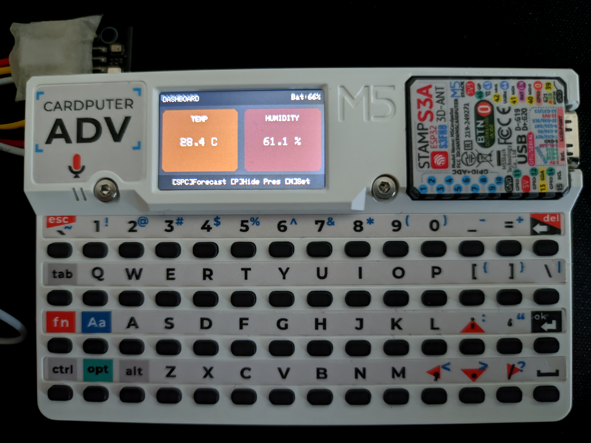

# CardMeteo_AHT_BMP

Weather station for M5Stack Cardputer ADV with AHT20 + BMP280 sensors.

## Status

Old personal project shared for others. Refactored for readability, removed some incomplete features. Works but not actively maintained. Fork and modify if you find it useful.

## Wiring

Connect your sensor board to the Cardputer ADV Grove port:

```
─────────────────────────────────────────
Sensor Board     |    Cardputer ADV Grove
─────────────────────────────────────────
SCL  ───────────────────────────────> G1
GND  ───────────────────────────────> G
SDA  ───────────────────────────────> G2
VDD  ───────────────────────────────> 5V
```

## Controls

| Key | Action |
|-----|--------|
| **Space / Enter** | Switch between Dashboard and Forecast |
| **P** | Toggle pressure box on dashboard |
| **M** | Open/close settings (hold to save & exit) |
| **E / S / ↑ / ↓** | Navigate settings menu (up / down) |
| **A / D / ← / →** | Decrease / increase value |
| **1–5** | Switch theme (Default, Hacker, Ocean, Sunset, Light) |
| **0** | Toggle instant dim (absolute black) |
| **Esc / \`** | Restart (exit to M5Launcher) |

## Features

- **Dashboard**: Temperature, humidity, local pressure (toggle with P)
- **Forecast**: Sea-level pressure, weather prediction with adaptive trend detection
  - Pressure trend uses 5-min intervals with adaptive thresholds (2.0 hPa → 0.7 hPa)
  - Shows elapsed collection time and confidence (collecting → potential → confirmed)
- **Settings**: Altitude, update interval, sound alerts, brightness, auto-dim timeout
- **Auto-dim**: Screen blanks after timeout of inactivity (skips when in settings)
- **5 themes**: Color schemes with header/box/text colors

## On Device

<div align="left">
  
</div>


## Build & Flash

### Option 1: Direct Flash (Fastest)
1. Download the latest firmware from the [Releases](../../releases) page.
2. Flash it using standard tools like **esptool.py** or copy it directly to your SD card to use with **M5Launcher**.

### Option 2: Via VS Code
1. Install **VS Code** and the **PlatformIO IDE** extension.
2. Open this project folder in VS Code.
3. Connect your Cardputer via USB-C.
4. Click the **PlatformIO: Upload** button (the arrow icon in the bottom status bar) to build and flash the device.

### Option 3: Via Command Line (CLI)
Make sure you have `platformio` installed in your terminal, then run:

```bash
# Install dependencies and build the firmware
platformio run

# Build, flash to device, and open the serial monitor
platformio run --target upload --target monitorr